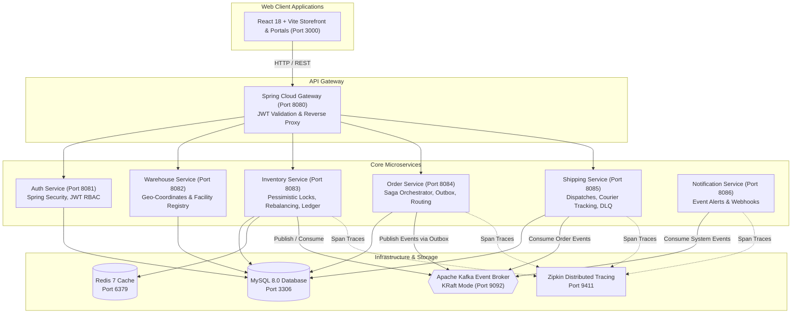

<div align="center">

# 📦 FulfillIQ

### Distributed Multi-Warehouse Intelligent Order Fulfillment & Supply Chain Platform

[](https://www.oracle.com/java/)
[](https://spring.io/projects/spring-boot)
[](https://reactjs.org/)
[](https://www.typescriptlang.org/)
[](https://www.mysql.com/)
[](https://kafka.apache.org/)
[](https://redis.io/)
[](https://zipkin.io/)
[](https://www.docker.com/)

<p align="center">
  <b>An enterprise-grade, event-driven microservices platform engineered for real-time inventory synchronization, geo-distributed order routing, automated warehouse rebalancing, and resilient fulfillment workflows.</b>
</p>

[Key Features](#-key-features) • [System Architecture](#-system-architecture) • [Engineering Highlights](#-engineering-highlights) • [Microservices Overview](#-microservices-overview) • [Getting Started](#-getting-started) • [Seed Accounts](#-seed-accounts)

</div>

---

## 🌟 Overview

Modern e-commerce and retail supply chains struggle with fragmented inventories, split shipments, inventory stockouts, and order routing delays. **FulfillIQ** solves this with an event-driven microservices architecture that calculates geographic distance from delivery destinations to fulfillment facilities, reserves stock atomically with write-locks, coordinates multi-step distributed transactions, and automatically detects warehouse imbalances to recommend internal stock transfers.

---

## 🚀 Key Features

* **🗺️ Intelligent Geo-Distance Order Routing**: Evaluates Haversine distance from customer coordinates to regional warehouses (Delhi, Mumbai, Bangalore, Hyderabad, Kolkata, Chennai, Pune) to fulfill orders from the nearest facility with available stock.
* **⚖️ Warehouse Rebalancing & Stock Transfers**: Detects inventory deficits across hubs and provides end-to-end transfer state management (`PENDING` ➔ `IN_TRANSIT` ➔ `RECEIVED` / `REJECTED`) with pessimistic locking (`FOR UPDATE`).
* **🔄 Saga Pattern (Compensating Transactions)**: Executes distributed rollback and automatic payment refunds if inventory reservation fails downstream.
* **📬 Transactional Outbox Pattern**: Prevents event loss by recording domain events to an `outbox_events` table in the same DB transaction, dispatched asynchronously to Apache Kafka.
* **🛡️ Idempotent Payment Webhooks**: Protects callback endpoints against network duplicates and double-processing using state-checked idempotency guards.
* **🔁 Dead Letter Queue (DLQ) & Consumer Retries**: Implements Kafka back-off retry listeners; failed events automatically route to dead-letter topics for inspection.
* **🔭 Distributed Tracing**: Full request span tracking through **OpenTelemetry** and **Zipkin** across HTTP gateway requests and asynchronous Kafka message flows.
* **⚡ High-Throughput Caching**: Redis-backed cache layer for fast stock lookups with automatic cache eviction on stock movements.
* **💻 Modern Glassmorphism Web Console**: Responsive React + Vite dashboard featuring Customer Storefront, Manager Facility Console, and Admin Supply Chain Operations.

---

## 🏗️ System Architecture



---

## 🛠️ Microservices Overview

| Microservice | Port | Database / Broker | Key Responsibilities |
| :--- | :---: | :--- | :--- |
| **`gateway-service`** | `8080` | *None* | Central reverse proxy, CORS policy, JWT token verification, dynamic route dispatch. |
| **`auth-service`** | `8081` | MySQL (`users`) | User registration, login authentication, BCrypt password hashing, JWT token generation. |
| **`warehouse-service`** | `8082` | MySQL (`warehouses`) | Facility locations, capacity management, geo-coordinate distance computation. |
| **`inventory-service`** | `8083` | MySQL, Redis, Kafka | Stock reservations, pessimistic write locking (`FOR UPDATE`), internal stock transfers, audit ledger. |
| **`order-service`** | `8084` | MySQL, Kafka | Nearest-warehouse routing, Saga compensation & refunds, Transactional Outbox scheduler. |
| **`shipping-service`** | `8085` | MySQL, Kafka | Dispatch lifecycle, tracking numbers, Kafka consumer retries, Dead Letter Queue (`order-created.DLQ`). |
| **`notification-service`** | `8086` | Kafka | Real-time event consumption, customer notifications, and status alerts. |
| **`frontend`** | `3000` | LocalStorage Sync | React 18, TypeScript, Material UI, Redux Toolkit, real-time tracking timeline, admin analytics. |

---

## ⚙️ Engineering Highlights

### 1. The Saga Pattern (Compensating Transactions)
When a customer completes payment but a concurrent race condition exhausts warehouse stock before allocation:
```
[Order Created] ➔ [Payment Success] ➔ [Inventory Reservation Fails]
                                                │
                                                ▼ (Automatic Compensation)
[Order Status: CANCELLED] ◄── [Refund Issued] ◄── [Outbox: ORDER_CANCELLED]
```

### 2. Transactional Outbox Pattern
Direct dual-writes to the database and Kafka inside a single transaction can cause message loss if the network fails midway. FulfillIQ records outbound events to an `outbox_events` table in the exact same DB transaction:
* Background daemon thread sweeps pending records every `1000ms`.
* Dispatches payloads to Kafka and purges records only after receiving broker ACK.

### 3. Pessimistic Write Locking (`FOR UPDATE`)
Stock transfers and checkout reservations acquire explicit pessimistic write locks on the `warehouse_inventory` table (`findByWarehouseIdAndProductIdForUpdate`). This prevents dirty reads, lost updates, and phantom reads under high-concurrency checkout traffic.

### 4. Kafka Error Handling & Dead Letter Queue (DLQ)
Registered Spring Kafka `CommonErrorHandler` with `FixedBackOff(1000ms, 3)`. Poison-pill payloads or consumer crashes trigger 3 controlled retries before routing to `order-created.DLQ`, preventing topic head-of-line blocking.

### 5. Warehouse Rebalancing (Internal Stock Transfers)
Solves inventory skew across regional warehouses (e.g. Delhi Hub with 800 laptops vs. Mumbai Terminal with 5 laptops). Facilities can initiate transfer requests, source managers approve and deduct stock (`IN_TRANSIT`), and destination managers confirm receipt (`RECEIVED`) to atomically increase local stock levels.

---

## 💻 Tech Stack

* **Backend**: Java 21, Spring Boot 3.3.2, Spring Cloud Gateway, Spring Data JPA / Hibernate 6, Spring Security, Spring Kafka
* **Frontend**: React 18, TypeScript, Vite, Material UI (MUI v5), Redux Toolkit, Emotion, Lucide Icons
* **Database & Caching**: MySQL 8.0, Redis 7.0 (Alpine)
* **Message Broker**: Apache Kafka 7.4 (KRaft mode - Zookeeperless)
* **Observability**: OpenTelemetry, Micrometer Tracing, Zipkin
* **Containerization**: Docker, Docker Compose v3.8, Multi-stage Dockerfiles

---

## 🚦 Getting Started

### Prerequisites
* [Docker Desktop](https://www.docker.com/products/docker-desktop/) (v20.10+ with Compose v2.0+)
* [Java JDK 21](https://adoptium.net/) & [Maven 3.9+](https://maven.apache.org/) *(optional, for local development outside Docker)*
* [Node.js 18+](https://nodejs.org/) & [npm](https://www.npmjs.com/) *(optional, for frontend dev mode)*

### 1. Clone the Repository
```bash
git clone https://github.com/snehal-100/FullFilQ.git
cd FullFilQ
```

### 2. Run with Docker Compose (Recommended)
Launch the entire platform including MySQL, Redis, Kafka, Zipkin, all 7 Spring Boot microservices, and the React frontend:

```bash
docker compose up --build -d
```

> **Note**: On the first launch, MySQL will automatically execute `init-db/init-db.sql` to create schemas and seed initial warehouses, products, stock levels, and user accounts.

### 3. Access the Dashboards
* 🛍️ **Web Application (Storefront & Portals)**: [http://localhost:3000](http://localhost:3000)
* 🌐 **API Gateway**: [http://localhost:8080](http://localhost:8080)
* 🔍 **Zipkin Distributed Tracing**: [http://localhost:9411](http://localhost:9411)

---

## 👤 Seed Accounts

Use these pre-configured credentials to explore the different role-based views:

| Role | Email | Password | Access & Capabilities |
| :--- | :--- | :--- | :--- |
| **Administrator** | `admin@fulfilliq.com` | `adminpassword` | Full system overview, inventory ledger, facility metrics, warehouse rebalancing controls. |
| **Warehouse Manager** | `manager@fulfilliq.com` | `managerpassword` | Picking list, shipment dispatch controls, facility stock adjustments, transfer approvals. |
| **Customer** | `customer@fulfilliq.com` | `customerpassword` | Product catalog, cart & checkout, live order tracking with visual timeline. |

---

## 📡 REST API Reference Sample

### Authentication
* `POST /api/auth/register` — Register a new customer account
* `POST /api/auth/login` — Authenticate and receive a signed JWT bearer token

### Inventory & Warehouse Transfers
* `GET /api/inventory/warehouse/{warehouseId}` — Retrieve current stock levels for a facility
* `POST /api/inventory/add` — Restock or adjust warehouse inventory
* `GET /api/inventory/transfers` — List all inter-facility transfer requests
* `POST /api/inventory/transfers` — Create an internal stock rebalance request
* `PUT /api/inventory/transfers/{id}/status` — Update transfer status (`IN_TRANSIT`, `RECEIVED`, `REJECTED`)

### Orders & Routing
* `POST /api/orders` — Place order; triggers nearest-warehouse routing and stock reservation
* `GET /api/orders/customer/{customerId}` — List customer order history
* `POST /api/orders/payment/callback` — Idempotent payment webhook endpoint

### Shipping
* `GET /api/shipping/order/{orderId}` — Retrieve tracking details and courier metadata
* `PUT /api/shipping/{shipmentId}/status` — Update courier delivery status

---

## 📂 Project Directory Structure

```text
FullfilQ/
├── docker-compose.yml          # Container configuration for all services & infra
├── pom.xml                     # Maven Parent POM (dependencies, plugins, BOM)
├── init-db/
│   └── init-db.sql             # MySQL 8.0 schema creation and catalog seed scripts
├── gateway-service/            # Spring Cloud Gateway reverse proxy (port 8080)
├── auth-service/               # Authentication & JWT security service (port 8081)
├── warehouse-service/          # Warehouse registry & geo-distance service (port 8082)
├── inventory-service/          # Inventory ledger, write locks, rebalancing (port 8083)
├── order-service/              # Order placement, routing, Saga, Outbox (port 8084)
├── shipping-service/           # Fulfillment dispatch, tracking, Kafka retries (port 8085)
├── notification-service/       # Event listener & notification dispatch (port 8086)
└── frontend/                   # React 18, TypeScript, MUI, Vite application (port 3000)
    ├── src/
    │   ├── pages/              # Customer, Manager, Admin, and Tracking dashboards
    │   ├── store/              # Redux slices for auth, cart, and orders
    │   └── App.tsx             # Route declarations and local offline mock sync
    └── package.json
```

---

## 📜 License

This project is licensed under the MIT License — see the [LICENSE](LICENSE) file for details.
